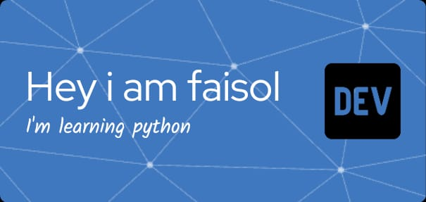

## Hello world! I'm mfaisol

<!--
**mfaisol919/mfaisol919** is a ✨ _special_ ✨ repository because its `README.md` (this file) appears on your GitHub profile.

Here are some ideas to get you started:

- 🔭 I’m currently working on ...
- 🌱 I’m currently learning ...
- 👯 I’m looking to collaborate on ...
- 🤔 I’m looking for help with ...
- 💬 Ask me about ...
- 📫 How to reach me: ...
- 😄 Pronouns: ...
- ⚡ Fun fact: ...
-->

- 🌱 I’m currently learning python

  

  - 📖 I'm learning python

    ### **Learning**

    

  #### **My Github Stats**


<div align="center">
  
</div>

<h1 align="center">🏴‍☠️ Moh Faisol 🏴‍☠️</h1>

<p align="center">
  <i>"Aku akan menjadi Raja Programmer!"</i>
</p>

<p align="center">
  
  
  
</p>

---

## 1. 🧭 Impian Sang Kapten (Motivasi Hidup)

Mimpiku adalah menjadi programmer yang handal dan mengarungi lautan kode untuk menjadi *solo developer game*! Sama seperti Luffy yang mencari One Piece, aku suka game meski tidak terlalu pandai memainkannya, jadi biar aku saja yang membuat gamenya sendiri (seperti Franky merakit Thousand Sunny)!

## 2. ⚡ Kekuatan Haki & Buah Iblis (Kemampuan Teknologi)

**Bahasa Pemrograman & Teknologi:**


## 3. ⚽ Harta Karun yang Telah Ditemukan (Proyek)

### 🏟️ Sistem Reservasi Lapangan Futsal

Website sistem reservasi lapangan futsal yang dirancang untuk memudahkan pelanggan dalam melihat ketersediaan lapangan dan melakukan pemesanan secara online. Sistem ini juga membantu pengelola dalam mengatur jadwal reservasi dan mengelola data pemesanan agar lebih terorganisir.

* **Peran:** Backend & Database Designer
* **Log Pose (Tautan):** [Repositori GitHub](#)

## 4. 📜 Logbook Pelayaran (Bukti Commit)

Lencana Profil: [](#)

```bash
$ git log --oneline -5

docs(p1): init My Profile index
```

## 5. 🗺️ Peta Petualangan (Riwayat Pendidikan)

| Tahun   | Pulau / Institusi | Fraksi / Jurusan |
| ------- | ----------------- | ---------------- |
| Lulusan | SMA AN-NIDHAMIYAH | IPS              |
| Lulusan | SMP AN-NIDHAMIYAH | -                |
| Lulusan | MI AN-NIDHAMIYAH  | -                |

## 6. 🪪 Vivre Card (Identitas Pribadi)

Moh Faisol — Pamekasan, Jawa Timur
**Den Den Mushi (Kontak):** `mfaisol919@gmail.com`

---

<p align="center">
  Dibuat dengan 🍖 oleh Moh Faisol <br>
  <a href="#">Tautan Video</a> | <a href="#">Tautan Repositori</a>
</p>
